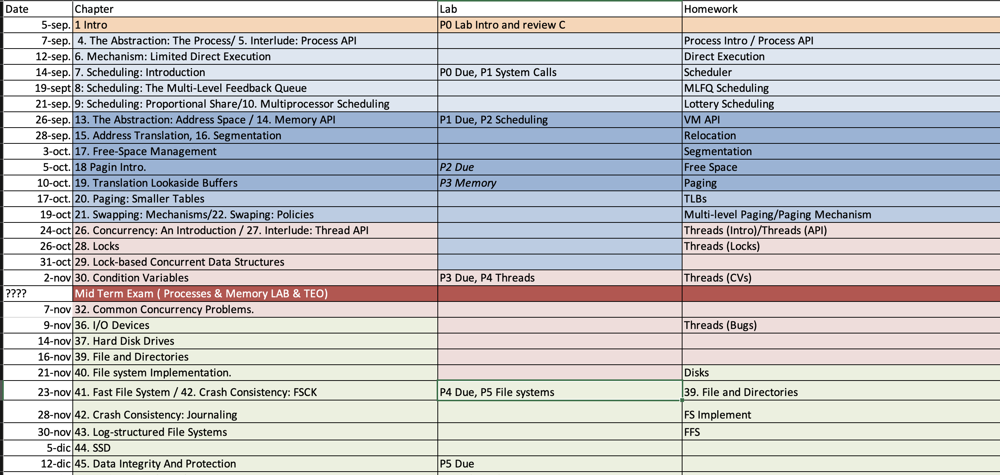

# Lecture Notes of course  [G667](http://web.unican.es/centros/caminos/estudios/detalle-asignatura?c=G677&p=98&a=2016) at [University of Cantabria](http://web.unican.es/en/Pages/default.aspx)

## Schedule

## Slides and Reference Material

0. **Course Presentation**  [Slides](00_Presentacion.pdf)
1. **Introduction to Operating systems** [[Slides](01_Introduction_to_operating_system.pdf)],[,[Book chapter](http://pages.cs.wisc.edu/~remzi/OSTEP/intro.pdf)]
2.  **Virtualization**
	4. The Abstraction: The Process [[Slides](04.The_abtrasction_the_process.pdf)],[[Book Chapter](http://pages.cs.wisc.edu/~remzi/OSTEP/cpu-intro.pdf)]
	5. Interlude: Process API [[Slides](05.Interlude_process_api.pdf)],[[Book Chapter](http://pages.cs.wisc.edu/~remzi/OSTEP/cpu-api.pdf)]
    6. Mechanism: Limited Direct Execution [[Slides](06.Mechanism_Limieted_Direct_Execution.pdf)],[[Book Chapter](http://pages.cs.wisc.edu/~remzi/OSTEP/cpu-mechanisms.pdf)]
    7. Scheduling Introduction [[Slides](07.Scheduling_Introduction.pdf)],[[Book Chapter](http://pages.cs.wisc.edu/~remzi/OSTEP/cpu-sched.pdf)]
    8. Scheduling: The Multi-Level Feedback Queue [[Slides](08.Scheduling_The_Multi-level_Feedback_queue.pdf)],[[Book Chapter]()]
    9. Scheduling: Proportional Share [[Slides](09.Scheduling_Proportional_Share.pdf)],[[Book Chapter](http://pages.cs.wisc.edu/~remzi/OSTEP/cpu-sched-lottery.pdf)]
    10. Multiprocessor Scheduling (Advanced) [[Slides](10.Multiprocessor_Scheduling(Advaned).pdf)],[[Book Chapter](http://pages.cs.wisc.edu/~remzi/OSTEP/cpu-sched-multi.pdf)]
    13. The Abstraction: Address Spaces [[Slides](13.The_Abstraction_Address_Space.pdf)],[[Book Chapter](http://pages.cs.wisc.edu/~remzi/OSTEP/vm-intro.pdf)]
    14.  Interlude: Memory API [[Slides](14.Memory_API.pdf)],[[Book Chapter](http://pages.cs.wisc.edu/~remzi/OSTEP/vm-api.pdf)]
    15. Mechanism: Address Translation [[Slides](15.Address_Translation.pdf)],[[Book Chapter](http://pages.cs.wisc.edu/~remzi/OSTEP/vm-mechanism.pdf)]
    16. Segmentation [[Slides](16.Segmentation.pdf)],[[Book Chapter](http://pages.cs.wisc.edu/~remzi/OSTEP/vm-segmentation.pdf)]
    17. Free Sapace Management [[Slides](17.Free-spac_Management.pdf)],[[Book Chapter](http://pages.cs.wisc.edu/~remzi/OSTEP/vm-freespace.pdf)]
    18. Paging Introduction [[Slides](18.Paging_Introduction.pdf)],[[Book Chapter](http://pages.cs.wisc.edu/~remzi/OSTEP/vm-paging.pdf)]
    19. TLB [[Slides](19.Translation_Lookaside_Buffers.pdf)],[[Book Chapter](http://pages.cs.wisc.edu/~remzi/OSTEP/vm-tlbs.pdf)]
    20. Advanced Page Tables [[Slides](20.Advanced_Page_Tables.pdf)],[[Book Chapter](http://pages.cs.wisc.edu/~remzi/OSTEP/vm-smalltables.pdf)]
    21. Swapping Mechanisms [[Slides](21.Swapping_Mechanism.pdf)],[[Book Chapter](http://pages.cs.wisc.edu/~remzi/OSTEP/vm-beyondphys.pdf)]
    22. Swapping Policies [[Slides](22.Swapping_Policies.pdf)],[[Book Chapter](http://pages.cs.wisc.edu/~remzi/OSTEP/vm-beyondphys-policy.pdf)]
23. **Concurrency**
    26. Concurrency an Introduction [[Slides](26.Concurrency_An_Introduction.pdf)],[[Book Chapter](http://pages.cs.wisc.edu/~remzi/OSTEP/threads-intro.pdf)]
    27. Thread API [[Slides](27.Interlude_Thread_API.pdf)],[[Book Chapter](http://pages.cs.wisc.edu/~remzi/OSTEP/threads-api.pdf)]
    28. Locks [[Slides](28.Locks.pdf)],[[Book Chapter](http://pages.cs.wisc.edu/~remzi/OSTEP/threads-locks.pdf)]
    29. Locked Data Structures [[Slides](29.Lock-based_Concurrent_Data_Structures.pdf)],[[Book Chapter](http://pages.cs.wisc.edu/~remzi/OSTEP/threads-locks-usage.pdf)]
    30. Condition Variables [[Slides](30.Condition_Variables.pdf)],[[Book Chapter](http://pages.cs.wisc.edu/~remzi/OSTEP/threads-cv.pdf)]
    31. Semaphores [[Slides](31.Semaphore.pdf)],[[Book Chapter](http://pages.cs.wisc.edu/~remzi/OSTEP/threads-sema.pdf)]
    32. Concurrency Bugs [[Slides](32.Common_Concurrency_Problems.pdf)],[[Book Chapter](http://pages.cs.wisc.edu/~remzi/OSTEP/threads-bugs.pdf)
    33. Event Based Concurrency [[Slides](33.Event-based_Concurrency(Advanced).pdf)],[[Book Chapter](http://pages.cs.wisc.edu/~remzi/OSTEP/threads-events.pdf)
24. **Persistency**
    36. I/O Devices [[Slides](36.IO_Devices.pdf)],[[Book Chapter](http://pages.cs.wisc.edu/~remzi/OSTEP/file-devices.pdf)]
    37. Hard Disks [[Slides](37.Hard_Disk_Drives.pdf)],[[Book Chapter](http://pages.cs.wisc.edu/~remzi/OSTEP/file-disks.pdf)]
    39. Files and Directories [[Slides](39.File_and_Directories.pdf)],[[Book Chapter](http://pages.cs.wisc.edu/~remzi/OSTEP/file-intro.pdf)]
    40. File System Implementation [[Slides](40.File_system_Implementation.pdf)],[[Book Chapter](http://pages.cs.wisc.edu/~remzi/OSTEP/file-implementation.pdf)]
    41. Fast File System (FFS) [[Slides](41.Locality_and_The_Fast_File_System.pdf)],[[Book Chapter](http://pages.cs.wisc.edu/~remzi/OSTEP/file-ffs.pdf)]
    42. FSCK and Journaling [[Slides](42.Crash_Consistency_FSCK_and_Journaling.pdf)],[[Book Chapter](http://pages.cs.wisc.edu/~remzi/OSTEP/file-journaling.pdf)]
    43. Log-structured File System (LFS) [[Slides](43.Log-structured_File_System.pdf)],[[Book Chapter](http://pages.cs.wisc.edu/~remzi/OSTEP/file-lfs.pdf)]
    44. SSD Disks [[Slides](44.Flash_based_ssd.pdf)],[[Book Chapter](http://pages.cs.wisc.edu/~remzi/OSTEP/file-ssd.pdf)]~~
    
## Labs Material
* * [Private Repo](https://gitlab.com/AOSUC/Lab/).

## Exams

* Course 2016/17 [part1](examen1-1617.pdf)[part2](examen2-1617.pdf)[part3](examen3-1617.pdf)[final](Examen_Feb_1617.pdf)

## Material to develop the Labs

* [Vagrant Image]( https://atlas.hashicorp.com/vpuente/boxes/AOSUC). Debian 8 (Jessie) ready 
to develop the Lab assignments. Requires Virtual-Box as provider. Works in Windows/OSX. Alternatively
you can use Linux subsystem in Windows 10 and port/brew is OSXhttp://beej.us/guide/bggdb/.
